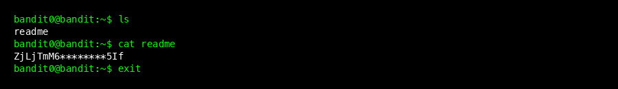
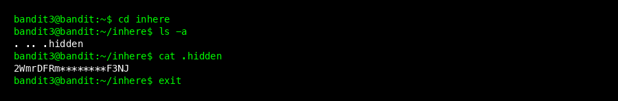
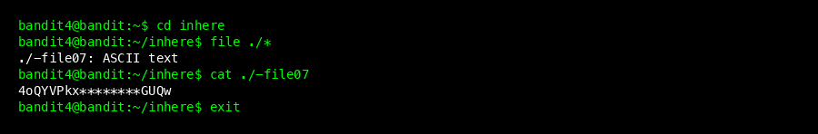
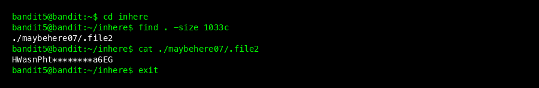

# Bandit Wargame Walkthrough (Level 0 - 10)

This guide provides step-by-step solutions for Bandit Level 0 to Level 10. It is designed for beginners, explaining not just *what* to type, but *why*.

## Level 0

### Goal
Log in to the game using SSH.
- **Host:** `bandit.labs.overthewire.org`
- **Port:** `2220`
- **User:** `bandit0`
- **Password:** `bandit0`

### Steps
1.  Open your terminal.
2.  Connect via SSH:
    ```bash
    ssh bandit0@bandit.labs.overthewire.org -p 2220
    ```
3.  Enter password `bandit0`.

### Beginner Tip: Why -p 2220?
SSH usually runs on port 22. Bandit uses port 2220 to avoid conflicts and for security obscurity. We must specify it with `-p`.

---

## Level 0 -> 1



### Goal
The password for the next level is stored in a file called `readme` located in the home directory.

### Steps
1.  List the files in the current directory:
    ```bash
    ls
    ```
2.  Read the `readme` file:
    ```bash
    cat readme
    ```
3.  **Password found:** `ZjLjTmM6FvvyRnrb2rfNWOZOTa6ip5If`
4.  Logout (`exit`) and login to Level 1 as `bandit1`.

### Command Explanation
- `ls`: **L**i**s**t directory contents.
- `cat`: **Cat**enate (read) file content to the screen.

---

## Level 1 -> 2


### Goal
The password is stored in a file named `-` located in the home directory.

### Steps
1.  If you try `cat -`, it won't work because `-` usually means "standard input" (stdin) in commands.
2.  To tell the shell "I mean the file named -", use the relative path `./`:
    ```bash
    cat ./-
    ```
3.  **Password found:** `263JGJPfgU6LtdEvgfWU1XP5yac29mFx`
4.  Logout and login to Level 2.

### Beginner Tip: What is ./?
`./` represents the **current directory**. By prepending it, we explicitly tell the command to look for a file in this folder, avoiding confusion with command flags (like `-r` or `-p`).

---

## Level 2 -> 3


### Goal
The password is stored in a file named `spaces in this filename` located in the home directory.

### Steps
1.  Check directory contents with `ls`. You'll see a filename with spaces.
2.  The shell uses spaces to separate arguments. To treat it as one filename, use quotes:
    ```bash
    cat "spaces in this filename"
    ```
3.  **Password found:** `MNk8KNH3U8DUnzkUi6obeux76kpq4Wqa`
4.  Logout and login to Level 3.

### Alternative Method
You can also escape spaces with backslashes:
```bash
cat spaces\ in\ this\ filename
```
This tells the shell to treat the space as a literal character, not a separator.

---

## Level 3 -> 4



### Goal
The password is stored in a hidden file in the `inhere` directory.

### Steps
1.  Enter the `inhere` directory:
    ```bash
    cd inhere
    ```
2.  Use `ls`. It might look empty.
3.  Use `ls -a` to see **hidden files** (files starting with a dot `.`):
    ```bash
    ls -a
    ```
4.  You will see `.hidden`. Read it:
    ```bash
    cat .hidden
    ```
5.  **Password found:** `2WmrDFRmJIq3IPxneAaMGhap0pFhF3NJ`

### Command Explanation
- `cd`: **C**hange **D**irectory.
- `ls -a`: The `-a` flag stands for **all**, showing hidden files.

---

## Level 4 -> 5



### Goal
The password is stored in the `inhere` directory and has the following properties: human-readable, 1033 bytes in size, not executable.

### Steps
1.  Enter `inhere`:
    ```bash
    cd inhere
    ```
2.  List files. You will see `-file00` through `-file09`.
3.  Use the `file` command to determine the type of data in each file:
    ```bash
    file ./*
    ```
4.  Look for the one that says `ASCII text`. Usually, it's `-file07`.
5.  Read it:
    ```bash
    cat ./-file07
    ```
6.  **Password found:** `4oQYVPkxZOOE005pTW81FB8j81xXGUQw`

### Command Explanation
- `file`: Identification tool that reads the file header (magic numbers) to tell you if it's text, data, image, etc.
- `./*`: Matches all files in the current directory.

---

## Level 5 -> 6



### Goal
The password is stored in `inhere` directory with specific properties:
- Human-readable
- **1033 bytes in size**
- Not executable

### Steps
1.  Enter `inhere`: `cd inhere`.
2.  Manual searching is tedious. Use `find` to search based on properties:
    ```bash
    find . -size 1033c
    ```
3.  The output will show `./maybehere07/.file2`.
4.  Read it:
    ```bash
    cat ./maybehere07/.file2
    ```
5.  **Password found:** `HWasnPhtq9AVKe0dmk45nxy20cvUa6EG`

### Command Explanation
- `find .`: Search in current directory (`.`).
- `-size 1033c`: Look for files with exactly 1033 **c**haracters (bytes).

---

## Level 6 -> 7


### Goal
The password is stored somewhere on the server (not just in home) with:
- User: `bandit7`
- Group: `bandit6`
- Size: 33 bytes

### Steps
1.  We need to search the entire system (`/`).
2.  The command will generate many "Permission denied" errors. We can hide them by redirecting errors to `/dev/null`.
    ```bash
    find / -user bandit7 -group bandit6 -size 33c 2>/dev/null
    ```
3.  The cleanup output will show one file: `/var/lib/dpkg/info/bandit7.password`.
4.  Read it:
    ```bash
    cat /var/lib/dpkg/info/bandit7.password
    ```
5.  **Password found:** `morbNTDkSW6jIlUc0ymOdMaLnOlFVAaj`

### Beginner Tip: What is 2>/dev/null?
- `2`: Represents **Standard Error** (stderr), where error messages go.
- `>`: Redirects output.
- `/dev/null`: A "black hole" in Linux. Anything sent here disappears.
So `2>/dev/null` means "throw away all error messages".

---

## Level 7 -> 8


### Goal
The password is stored in `data.txt` next to the word "millionth".

### Steps
1.  The file `data.txt` is huge. Don't use `cat`.
2.  Use `grep` to search for the specific word:
    ```bash
    grep "millionth" data.txt
    ```
3.  **Password found:** `dfwvzFQi4mU0wfNbFOe9RoWskMLg7eEc`

### Command Explanation
- `grep`: **G**lobal **R**egular **E**xpression **P**rint. Used to find text patterns.

---

## Level 8 -> 9


### Goal
The password is the **only line of text that occurs only once** in `data.txt`.

### Steps
1.  The file has many duplicate lines. We need to find the unique one.
2.  Use `uniq -u` (unique). However, `uniq` only works on **adjacent** duplicates, so we must `sort` the file first.
    ```bash
    sort data.txt | uniq -u
    ```
3.  **Password found:** `4CKMh1JI91bUIZZPXDqGanal4xvAg0JM`

### Beginner Tip: The Pipe (|)
The `|` character takes the **output** of the command on the left (`sort`) and feeds it as **input** to the command on the right (`uniq`). This allows chaining commands together.

---

## Level 9 -> 10


### Goal
The password is in `data.txt` (a binary file) in one of the few human-readable strings, preceded by multiple `=` characters.

### Steps
1.  If you `cat` a binary file, your terminal might crash. Use `strings` to extract readable text.
2.  Pipe it to `grep` to look for the marker `=`.
    ```bash
    strings data.txt | grep "="
    ```
3.  Look for the line `========== the*password` followed by the password.
4.  **Password found:** `FGUW5ilLVJrxX9kMYMm1N4MgbpfMiqey`

### Command Explanation
- `strings`: Scans a binary file and prints any sequence of printable characters.

---

## Level 10 -> 11


### Goal
The password is in `data.txt`, which contains Base64 encoded data.

### Steps
1.  Base64 is a common encoding format (ends with `=`).
2.  Decode it using `base64 -d`:
    ```bash
    base64 -d data.txt
    ```
3.  **Password found:** `dtR173fZKb0RRsDFSGsg2RWnpWPjqlND`
