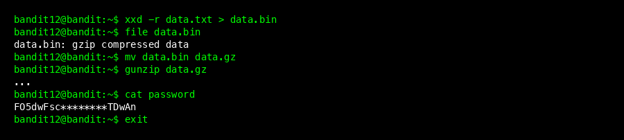
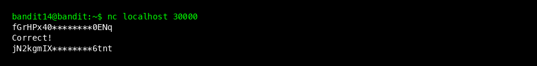
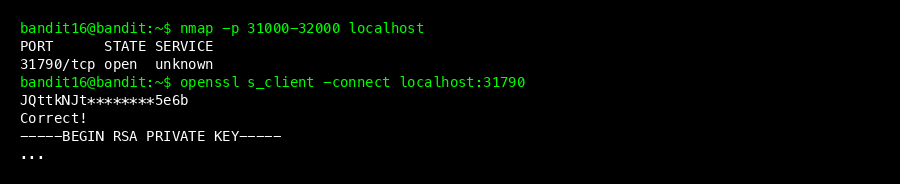
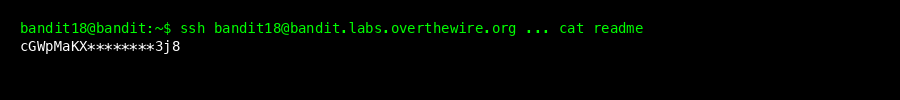
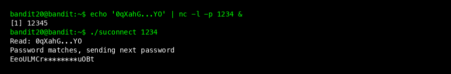

# Bandit Wargame Walkthrough (Level 11 - 20)

This guide continues from Level 11. The challenges now involve more complex Linux commands, networking, and permissions.

## Level 11 -> 12


### Goal
The password is stored in `data.txt`, where all letters are rotated by 13 positions (ROT13 encryption).

### Steps
1.  ROT13 is a simple substitution cipher. 'A' becomes 'N', 'B' becomes 'O', and so on.
2.  Use the `tr` (translate) command to reverse this.
    ```bash
    cat data.txt | tr 'A-Za-z' 'N-ZA-Mn-za-m'
    ```
3.  **Password found:** `7x16WNeHIi5YkIhWsfFIqoognUTyj9Q4`

### Command Explanation
- `tr 'A-Za-z' 'N-ZA-Mn-za-m'`: Tells `tr` to map every character in the first set (A-Z, a-z) to the corresponding character in the second set (N-Z-A-M, n-z-a-m). This effectively rotates letters by 13.

---

## Level 12 -> 13



### Goal
The password is stored in `data.txt`, which is a hexdump of a file that has been repeatedly compressed.

### Steps
1.  This level requires creating a workspace because we don't have write permission in the home directory.
    ```bash
    mkdir /tmp/mysolution
    cp data.txt /tmp/mysolution
    cd /tmp/mysolution
    ```
2.  The file is a hexdump (text representation of binary). Reverse it using `xxd`:
    ```bash
    xxd -r data.txt > data.bin
    ```
3.  Now check the file type of `data.bin`:
    ```bash
    file data.bin
    ```
4.  It will be compressed (e.g., gzip, bzip2, or tar). Decompress it repeatedly until you get ASCII text.
    *   **If gzip:** Rename to `.gz` (`mv file file.gz`) then `gunzip file.gz`.
    *   **If bzip2:** Rename to `.bz2` (`mv file file.bz2`) then `bunzip2 file.bz2`.
    *   **If tar:** Use `tar -xvf file`.
5.  **Password found:** `FO5dwFsc0cbaIiH0h8J2eUks2vdTDwAn`

### Beginner Tip: Why rename?
Tools like `gzip` and `bzip2` often refuse to decompress a file unless it has the correct extension (like `.gz`). Renaming it tricks them into working.

---

## Level 13 -> 14


### Goal
The password for the next level is stored in `/etc/bandit_pass/bandit14`. You are provided with a private SSH key (`sshkey.private`) to login as `bandit14`.

### Steps
1.  Usually, you login with a password. Here, you use a **key file**.
2.  Use the `-i` flag to specify the key.
    ```bash
    ssh -i sshkey.private bandit14@localhost -p 2220
    ```
    *Note: We connect to `localhost` because we are already on the server.*
3.  Once logged in as `bandit14`, read the password file:
    ```bash
    cat /etc/bandit_pass/bandit14
    ```
4.  **Password found:** `fGrHPx402xGC7U7rXKDaxiWFTOiF0ENq`

---

## Level 14 -> 15



### Goal
Submit the current password to **port 30000** on localhost using `nc` (netcat).

### Steps
1.  Netcat (`nc`) is a tool to read/write network connections.
2.  Connect to port 30000:
    ```bash
    nc localhost 30000
    ```
3.  Paste the current password (`fGrHPx...`).
4.  **Password found:** `jN2kgmIXJ6fShzhT2avhotn4Zcka6tnt`

---

## Level 15 -> 16


### Goal
Submit the current password to **port 30001** on localhost using **SSL encryption**.

### Steps
1.  `nc` cannot handle SSL/TLS encryption easily. Use `openssl`.
2.  Connect using the `s_client` (SSL client) module:
    ```bash
    openssl s_client -connect localhost:30001
    ```
3.  Paste the current password (`jN2kg...`).
4.  **Password found:** `JQttkNJtISi6doDnLC3qFCTCNJ905e6b`

### Beginner Tip: What is SSL?
SSL (Secure Sockets Layer) encrypts the connection so no one can eavesdrop. It's the technology behind checkouts and banking (HTTPS).

---

## Level 16 -> 17



### Goal
The password is on a port between **31000 and 32000**. We need to find which one is open and supports SSL.

### Steps
1.  Use `nmap` (Network Mapper) to scan the range:
    ```bash
    nmap -p 31000-32000 localhost
    ```
2.  Identify the open port (usually `31790`).
3.  Connect using SSL (like the previous level):
    ```bash
    openssl s_client -connect localhost:31790
    ```
4.  Submit the password. The server returns a **Private Key** (RSA KEY), not a password.
5.  Copy the key (from `-----BEGIN...` to `...END RSA PRIVATE KEY-----`) and save it to a file on your computer (e.g., `key17.private`).
6.  **Important:** Keys must be protected. Set permissions to read-only for the owner:
    ```bash
    chmod 600 key17.private
    ```
7.  Login to Level 17 using this key:
    ```bash
    ssh -i key17.private bandit17@bandit.labs.overthewire.org -p 2220
    ```

---

## Level 17 -> 18


### Goal
The password is the only line that has changed between `passwords.old` and `passwords.new`.

### Steps
1.  Use the `diff` command to compare files side-by-side.
    ```bash
    diff passwords.old passwords.new
    ```
2.  Lines starting with `<` are from the first file. Lines with `>` are from the second.
3.  Identify the new password in the output.
4.  **Password found:** `x2gLTTjFwMOhQ8oWNbMN362QKxfRqGlO` (example)

---

## Level 18 -> 19



### Goal
The password is in `readme`. But when you login, you are immediately logged out!

### Steps
1.  The startup script `.bashrc` logs you out. We need to bypass it.
2.  You can ask SSH to run a command *instead* of starting a shell.
    ```bash
    ssh bandit18@bandit.labs.overthewire.org -p 2220 "cat readme"
    ```
3.  This runs `cat readme` remotely and shows the output before disconnecting.
4.  **Password found:** `cGWpMaKXVwDUNgPAVJbWYuGHVn9zl3j8`

---

## Level 19 -> 20


### Goal
Use a binary `bandit20-do` to read the password file.

### Steps
1.  Run the binary to see how it works: `./bandit20-do`. It runs commands as another user (`bandit20`).
2.  Use it to read the password file `/etc/bandit_pass/bandit20`.
    ```bash
    ./bandit20-do cat /etc/bandit_pass/bandit20
    ```
3.  **Password found:** `0qXahG8ZjOVMN9Ghs7iOWsCfZyXOUbYO`

### Beginner Tip: Setuid
Files with the "Setuid" bit set run with the permissions of the **file owner**, not the user running it. This allows regular users to perform specific administrative tasks securely.

---

## Level 20 -> 21



### Goal
The `suconnect` binary connects to a port you specify and expects to receive the current password.

### Steps
1.  You need two terminals (or use background `&`).
2.  **Steps:**
    *   Set up a listener on port 1234 that sends the password:
        ```bash
        echo -n '0qXahG...YO' | nc -l -p 1234 &
        ```
    *   Run the binary to connect to your listener:
        ```bash
        ./suconnect 1234
        ```
3.  The binary connects to your `nc`, reads the password, verifies it, and sends back the new password.
4.  **Password found:** `EeoULMCra2q0dSkYj561DX7s1CpBuOBt`

---
